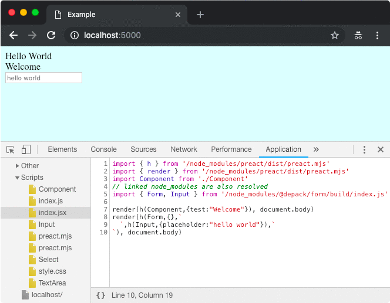

# @idio/frontend

[](https://npmjs.org/package/@idio/frontend)

`@idio/frontend` is The Middleware To Serve Front-End JavaScript. It allows to set-up the modern front-end development environment where `node_modules` are served alongside compiled JSX code (without using _Babel_, see [`@a-la/jsx`](https://github.com/a-la/jsx)).

```sh
yarn add -E @idio/frontend
```

## Table Of Contents

- [Table Of Contents](#table-of-contents)
- [API](#api)
- [`async frontend(config: FrontendConfig): Middleware`](#async-frontendconfig-frontendconfig-middleware)
  * [`FrontendConfig`](#type-frontendconfig)
- [Copyright](#copyright)

<p align="center"><a href="#table-of-contents"></a></p>

## API

The package is available by importing its default function:

```js
import frontend from '@idio/frontend'
```

<p align="center"><a href="#table-of-contents"></a></p>

## `async frontend(`<br/>&nbsp;&nbsp;`config: FrontendConfig,`<br/>`): Middleware`

The middleware constructor will initialise the middleware function to serve files from the specified directory (`frontend` by default). The files will be updated on-the-fly to fix their imports to relative paths (e.g., `preact` will be transformed into `/node_modules/preact/dist/preact.mjs`). Any CSS styles will also be served using an injector script.

__<a name="type-frontendconfig">`FrontendConfig`</a>__: Options for the middleware.

|   Name    |   Type   |                                                                                                           Description                                                                                                            |           Default            |
| --------- | -------- | -------------------------------------------------------------------------------------------------------------------------------------------------------------------------------------------------------------------------------- | ---------------------------- |
| directory | _string_ | The directory from which to serve files.                                                                                                                                                                                         | `frontend`                   |
| pragma    | _string_ | The pragma function to import. This enables to skip writing `h` at the beginning of each file. JSX will be transpiled to have `h` pragma, therefore to use React it's possible to do `import { createElement: h } from 'react'`. | `import { h } from 'preact'` |

The middleware can be used in any `Koa` application, or within the [`idio` web server](https://idio.cc).

```jsx
/* yarn example/ */
import core from '@idio/core'
import render from '@depack/render'
import frontend from '@idio/frontend'

(async () => {
  const { url, router, app } = await core({
    logger: { use: true },
    _frontend: {
      use: true,
      middlewareConstructor(_, config) {
        return frontend(config)
      },
      config: {
        directory: 'example/frontend',
      },
    },
  }, { port: process.env.PORT })
  router.get('/', async (ctx) => {
    ctx.body = '<!doctype html>\n' + render(
      <html>
        <head><title>Example</title></head>
        <body>
          Hello World
          <script type="module" src="example/frontend"/>
        </body>
      </html>)
  })
  app.use(router.routes())
  console.log('Started on %s', url)
})()
```

```m
example/frontend
├── Component.jsx
├── index.jsx
└── style.css
```

*The entry point*

```jsx
import { render } from 'preact'
import Component from './Component'
// linked node_modules are also resolved
import Form, { Input } from '@depack/form'

render(<Component test="Welcome"/>, document.body)
render(<Form>
  <Input placeholder="hello world"/>
</Form>, document.body)
```

*The component*

```jsx
import './style.css'

const Component = ({ test }) => {
  return <div>{test}</div>
}

export default Component
```

*The style*

```css
body {
  background: lightcyan;
}
```



<p align="center"><a href="#table-of-contents"></a></p>

## Copyright

<table>
  <tr>
    <th>
      <a href="https://artd.eco">
        
      </a>
    </th>
    <th>© <a href="https://artd.eco">Art Deco</a> for <a href="https://idio.cc">Idio</a> 2019</th>
    <th>
      <a href="https://idio.cc">
        
      </a>
    </th>
    <th>
      <a href="https://www.technation.sucks" title="Tech Nation Visa">
        
      </a>
    </th>
    <th><a href="https://www.technation.sucks">Tech Nation Visa Sucks</a></th>
  </tr>
</table>

<p align="center"><a href="#table-of-contents"></a></p>